# Architecture Documentation

This document provides a comprehensive overview of the Flickr to Instagram automation system architecture, including the modular orchestration design, state management systems, and security considerations.

## Table of Contents

- [Architecture Overview](#architecture-overview)
- [Modular Orchestration System](#modular-orchestration-system)
- [State Management Evolution](#state-management-evolution)
- [Workflow System](#workflow-system)
- [Security Architecture](#security-architecture)
- [Testing Strategy](#testing-strategy)
- [Migration Guide](#migration-guide)

## Architecture Overview

The system follows a modern, modular architecture with clear separation of concerns:

```mermaid
graph TB
    subgraph "External Dependencies"
        FA[📷 Flickr API]
        IA[📱 Instagram Graph API]
        OA[🤖 OpenAI GPT-4 Vision]
        WP[📝 WordPress API]
    end

    subgraph "GitHub Infrastructure"
        GH[🔧 GitHub Actions]
        GS[🔐 GitHub Secrets]
        GR[📁 Git Repository]
        GB[🌿 State Branch]
    end

    subgraph "Application Core"
        MC[🎮 Main Controller]

        subgraph "Orchestration Modules"
            PS[📸 Photo Selection]
            CO[✏️ Caption Orchestration]
            PO[📱 Posting Orchestration]
            SO[📊 State Orchestration]
        end

        subgraph "State Management"
            SM[📊 State Manager V2]
            SA[💾 Storage Adapter]
            MD[📋 State Models]
        end

        subgraph "API Integrations"
            FL[📷 Flickr Integration]
            CG[🤖 Caption Generator]
            IG[📱 Instagram Integration]
        end
    end

    FA --> FL
    IA --> IG
    OA --> CG
    WP --> CG

    GH --> MC
    GS --> MC
    GR --> SA
    GB --> SA

    MC --> PS
    MC --> CO
    MC --> PO
    MC --> SO

    PS --> FL
    CO --> CG
    PO --> IG
    SO --> SM

    SM --> SA
    SA --> MD
```



## Modular Orchestration System

### Core Design Principles

1. **Single Responsibility**: Each module handles one specific aspect of the workflow
2. **Dependency Injection**: Clean interfaces enable testing and flexibility
3. **Factory Pattern**: Centralized creation of orchestrator instances
4. **Error Isolation**: Failures in one module don't cascade to others

### Orchestration Modules

#### Photo Selection Module (`orchestration/photo_selection.py`)

**Purpose**: Handles photo discovery, selection, and validation logic.

**Key Components**:
- `PhotoSelector`: Selects the next photo to post from Flickr album
- `PhotoValidator`: Validates photo URLs and accessibility
- `PhotoSelectionResult`: Encapsulates selection results and metadata

**Workflow**:
1. Fetch photos from Flickr API
2. Check album completion status
3. Select next unposted photo
4. Validate image URL accessibility
5. Return selection result with metadata

#### Caption Orchestration Module (`orchestration/caption_orchestration.py`)

**Purpose**: Manages the complete caption generation workflow.

**Key Components**:
- `CaptionOrchestrator`: Coordinates AI caption generation
- `CaptionPreprocessor`: Enhances photo data for better context
- `CaptionResult`: Contains generated caption and generation metadata

**Workflow**:
1. Preprocess photo data for enhanced context
2. Generate caption using GPT-4 Vision
3. Apply fallback logic if generation fails
4. Build complete Instagram caption with hashtags
5. Validate caption length and content

#### Posting Orchestration Module (`orchestration/posting_orchestration.py`)

**Purpose**: Handles Instagram posting workflow and progress tracking.

**Key Components**:
- `InstagramPoster`: Manages actual Instagram posting logic
- `ProgressTracker`: Tracks posting progress and completion
- `PostingOrchestrator`: Coordinates complete posting workflow

**Workflow**:
1. Execute Instagram posting (or dry run simulation)
2. Track posting progress and update counters
3. Check for album completion
4. Return posting results with metadata

#### State Orchestration Module (`orchestration/state_orchestration.py`)

**Purpose**: Orchestrates state management operations and notifications.

**Key Components**:
- `StateOrchestrator`: Coordinates state recording and notifications
- `ValidationStateHandler`: Handles validation failure states
- `StateResult`: Encapsulates state operation results

**Workflow**:
1. Record posting outcomes to state storage
2. Log automation run results
3. Handle album completion notifications
4. Manage validation failure states

### Dependency Injection Pattern

The system uses factory functions to create orchestrator instances with injected dependencies:

```python
# Factory functions in orchestration/__init__.py
def create_photo_selector(flickr_api: FlickrAPI, state_manager: StateManager) -> PhotoSelector:
    return PhotoSelector(flickr_api, state_manager)

def create_caption_orchestrator(caption_generator: CaptionGenerator) -> CaptionOrchestrator:
    return CaptionOrchestrator(caption_generator)

def create_posting_orchestrator(instagram_api: InstagramAPI) -> PostingOrchestrator:
    return PostingOrchestrator(instagram_api)

def create_state_orchestrator(state_manager: StateManager, email_notifier: EmailNotifier) -> StateOrchestrator:
    return StateOrchestrator(state_manager, email_notifier)
```

**Benefits**:
- **Testability**: Easy mock injection for unit tests
- **Flexibility**: Different implementations for different environments
- **Maintainability**: Clear dependency relationships

## Workflow System

### Reusable Workflow Architecture

The system eliminates code duplication through a centralized reusable workflow:

```mermaid
graph TB
    subgraph "Account-Specific Workflows"
        PW[🏠 primary-flickr-to-insta.yml<br/>Account Configuration<br/>Environment: primary-account]
        SW[🌍 secondary-flickr-to-insta.yml<br/>Account Configuration<br/>Environment: secondary-account]
    end

    subgraph "Reusable Workflow"
        RW[📋 social-automation.yml<br/>Centralized Logic<br/>Parameterized Inputs]

        subgraph "Workflow Steps"
            S1[🔧 Setup Environment]
            S2[🐍 Install Dependencies]
            S3[📸 Execute Automation]
            S4[📊 Handle Completion]
            S5[📁 Upload Artifacts]
        end
    end

    PW --> RW
    SW --> RW

    RW --> S1
    S1 --> S2
    S2 --> S3
    S3 --> S4
    S4 --> S5
```



### Workflow Parameters

The reusable workflow accepts these inputs:
- `account_name`: Account identifier (primary/secondary)
- `environment_name`: GitHub environment name
- `dry_run`: Whether to run in dry-run mode
- `show_stats`: Whether to show statistics only

### Environment Isolation

Each account uses a separate GitHub environment:
- **primary-account**: Primary Instagram account configuration
- **secondary-account**: Secondary Instagram account configuration

## Security Architecture

### Multi-layered Security Approach

```mermaid
graph TB
    subgraph "Credential Management"
        GS[🔐 GitHub Secrets<br/>Encrypted at Rest]
        ENV[🌍 Environment Isolation<br/>Account Separation]
        PAT[🔑 Fine-grained PAT<br/>contents:write only]
    end

    subgraph "Access Control"
        RBAC[👥 Role-based Access<br/>Environment Protection]
        API[🛡️ API Validation<br/>Input Sanitization]
        HTTPS[🔒 HTTPS Only<br/>TLS Encryption]
    end

    subgraph "Audit & Monitoring"
        GIT[📜 Git History<br/>Complete Audit Trail]
        LOG[📊 Comprehensive Logging<br/>Workflow Artifacts]
        ALERT[🚨 Failure Notifications<br/>Email Alerts]
    end

    GS --> RBAC
    ENV --> RBAC
    PAT --> API
    API --> HTTPS
    RBAC --> GIT
    LOG --> ALERT
```



### Security Benefits by Component

#### Fine-grained Personal Access Token
- **Scope**: Only `contents:write` (not broad `repo`)
- **Repository-specific**: Access limited to single repository
- **Reduced Attack Surface**: Minimal permissions principle

#### Environment Isolation
- **Account Separation**: Each account has dedicated environment
- **Secret Isolation**: Environment-specific credentials
- **Protection Rules**: Deployment protection and approval workflows

#### Git-based State Storage
- **Audit Trail**: Full history of all state changes
- **Atomic Operations**: Prevents state corruption
- **Encryption**: All data encrypted at rest and in transit

## Testing Strategy

### Multi-level Testing Approach

```mermaid
graph TB
    subgraph "Unit Tests"
        UT1[🧪 Photo Selection Tests<br/>Mock Flickr API]
        UT2[🧪 Caption Generation Tests<br/>Mock OpenAI API]
        UT3[🧪 Posting Tests<br/>Mock Instagram API]
        UT4[🧪 State Management Tests<br/>Mock Git Operations]
    end

    subgraph "Integration Tests"
        IT1[🔗 End-to-End Workflow<br/>Real API Integration]
        IT2[🔗 State Persistence<br/>Git Storage Validation]
        IT3[🔗 Error Recovery<br/>Failure Scenarios]
    end

    subgraph "System Tests"
        ST1[🏗️ Workflow Execution<br/>GitHub Actions Testing]
        ST2[🏗️ Multi-account Setup<br/>Environment Isolation]
        ST3[🏗️ Migration Testing<br/>Legacy to Modern Transition]
    end

    UT1 --> IT1
    UT2 --> IT1
        UT4 --> IT2

    IT1 --> ST1
    IT2 --> ST2
    IT3 --> ST3
```



### Testing Infrastructure

#### Mock-based Unit Tests
```python
# Example: Photo selection testing
@patch('flickr_api.FlickrAPI.get_unposted_photos')
@patch('state_manager.StateManager.get_next_photo_to_post')
def test_photo_selection_success(self, mock_get_next, mock_get_photos):
    mock_get_photos.return_value = [test_photo_data]
    mock_get_next.return_value = test_photo_data

    result = photo_selector.get_next_photo_to_post()

    assert result.success
    assert result.photo['id'] == 'test_photo_id'
```

#### Integration Test Scenarios
- **Happy Path**: Complete workflow from photo selection to posting
- **Error Recovery**: API failures, network issues, validation errors
- **State Consistency**: Concurrent access, conflict resolution

## Conclusion

This architecture provides a robust, secure, and maintainable foundation for automated social media posting. The modular design enables easy testing and extension, while the Git-based state management offers superior security and auditability.

The reusable workflow pattern eliminates code duplication and simplifies maintenance across multiple accounts. The comprehensive testing strategy ensures reliability, and the migration tools provide a safe path for transitioning existing deployments.

For questions about the architecture or implementation details, refer to the inline code documentation and test suites.
