# Architecture Documentation

This document provides a comprehensive overview of the Flickr to Instagram automation system architecture, including the multi-account configuration system, enhanced content integration, state management, and security considerations.

## Table of Contents

- [Architecture Overview](#architecture-overview)
- [Multi-Account Configuration System](#multi-account-configuration-system)
- [Enhanced Content Integration](#enhanced-content-integration)
- [Modular Orchestration System](#modular-orchestration-system)
- [State Management System](#state-management-system)
- [Workflow System](#workflow-system)
- [Security Architecture](#security-architecture)
- [Testing Strategy](#testing-strategy)

## Architecture Overview

The system follows a modern, modular architecture with multi-account support, enhanced content integration, and clear separation of concerns:

```mermaid
graph TB
    subgraph "External Dependencies"
        FA[📷 Flickr API]
        IA[📱 Instagram Graph API]
        OA[🤖 OpenAI GPT-4 Vision]
        WP[📝 WordPress API]
        BE[🌐 Blog Content Extractor]
    end

    subgraph "GitHub Infrastructure"
        GH[🔧 GitHub Actions]
        GS[🔐 GitHub Secrets]
        GR[📁 Git Repository]
        GE[🌍 GitHub Environments]
    end

    subgraph "Account Configuration Layer"
        AC[⚙️ Account Config]
        ML[🌐 Multi-Language Support]
        AB[🎨 Account Branding]
    end

    subgraph "Application Core"
        MC[🎮 Main Controller]

        subgraph "Content Integration"
            BCE[📝 Blog Content Extractor]
            EUP[🔗 EXIF URL Prioritization]
            KM[🔍 Keyword Matching]
        end

        subgraph "Caption Generation"
            CG[🤖 Caption Generator]
            MLP[🌐 Multi-Language Prompts]
            BC[📚 Blog Context Integration]
        end

        subgraph "API Integrations"
            FL[📷 Flickr Integration]
            IG[📱 Instagram Integration]
        end

        subgraph "State Management"
            SM[📊 State Manager]
            SA[💾 Storage Adapter]
            MD[📋 State Models]
        end
    end

    FA --> FL
    IA --> IG
    OA --> CG
    WP --> BCE
    BE --> BCE

    GH --> MC
    GS --> AC
    GR --> SA
    GE --> AC

    AC --> ML
    AC --> AB
    AC --> CG

    MC --> BCE
    MC --> CG
    MC --> FL
    MC --> IG
    MC --> SM

    BCE --> EUP
    BCE --> KM
    BCE --> BC

    CG --> MLP
    CG --> BC
    BC --> CG

    SM --> SA
    SA --> MD
```



## Multi-Account Configuration System

### Account-Based Architecture

The system supports multiple Instagram accounts with independent configurations through the `account_config.py` module:

**Key Components**:
- `AccountConfig`: Centralized account management
- `MultiLanguageSupport`: German and English configurations
- `AccountBranding`: Account-specific branding and signatures
- `LanguageAwareGeneration`: Swiss German and English caption conventions

**Configuration Structure**:
```python
# Account-specific configuration
ACCOUNT_CONFIGS = {
    'primary': {
        'brand_name': 'YourBrand',
        'language': 'en',
        'signature': 'Your English brand signature',
        'blog_domain': 'your-english-blog.com',
        'prompt_style': 'english_travel_influencer'
    },
    'secondary': {
        'brand_name': 'IhreBrand',
        'language': 'de',
        'signature': 'Ihre deutsche Marken-Signatur',
        'blog_domain': 'ihre-deutsche-blog.de',
        'prompt_style': 'german_travel_influencer'
    }
}
```

**Benefits**:
- **Language Isolation**: Each account uses its native language and cultural conventions
- **Brand Consistency**: Account-specific branding and messaging
- **Independent Operation**: Separate state management and workflow execution
- **Scalable Design**: Easy addition of new accounts and languages

## Enhanced Content Integration

### Blog Content Extraction System

The enhanced `blog_content_extractor.py` provides intelligent content matching and extraction:

**Key Features**:
- **WordPress Authentication**: Full content access with application passwords
- **Keyword Matching**: Structured matching algorithms for content relevance
- **EXIF URL Prioritization**: Enhanced source URL tracking and prioritization
- **Content Scoring**: Advanced algorithms for content quality assessment

**Content Extraction Workflow**:


**Content Prioritization**:
1. **EXIF URL Priority**: Photos with source URLs get priority content matching
2. **Keyword Relevance**: Content scored based on location, activity, and description keywords
3. **Editorial Quality**: Full blog content provides richer context than excerpts
4. **Contextual Enhancement**: Blog content enhances AI caption generation

### Multi-Language Caption Generation

The `caption_generator.py` now supports sophisticated multi-language operations:

**Language-Specific Features**:
- **German Prompts**: Swiss German conventions and cultural context
- **English Prompts**: International travel influencer style
- **Cultural Adaptation**: Language-appropriate expressions and hashtag styles
- **Brand Integration**: Account-specific branding in native languages

**Enhanced Context Integration**:
```python
# Context building with blog content
context_parts = [
    f"Photo Title: {photo_data.get('title', 'N/A')}",
    f"Description: {photo_data.get('description', 'N/A')}",
    f"Location: {location_string}",
    f"Camera: {camera_info}",
    f"Blog Context: {blog_context[:500]}...",  # Rich editorial content
    f"Source: {source_url}"
]
```

## Modular Orchestration System

### Core Design Principles

1. **Single Responsibility**: Each module handles one specific aspect of the workflow
2. **Dependency Injection**: Clean interfaces enable testing and flexibility
3. **Factory Pattern**: Centralized creation of orchestrator instances
4. **Error Isolation**: Failures in one module don't cascade to others

### Orchestration Modules

#### Photo Selection Module (`orchestration/photo_selection.py`)

**Purpose**: Handles photo discovery, selection, and validation logic.

**Key Components**:
- `PhotoSelector`: Selects the next photo to post from Flickr album
- `PhotoValidator`: Validates photo URLs and accessibility
- `PhotoSelectionResult`: Encapsulates selection results and metadata

**Workflow**:
1. Fetch photos from Flickr API
2. Check album completion status
3. Select next unposted photo
4. Validate image URL accessibility
5. Return selection result with metadata

#### Caption Orchestration Module (`orchestration/caption_orchestration.py`)

**Purpose**: Manages the complete caption generation workflow.

**Key Components**:
- `CaptionOrchestrator`: Coordinates AI caption generation
- `CaptionPreprocessor`: Enhances photo data for better context
- `CaptionResult`: Contains generated caption and generation metadata

**Workflow**:
1. Preprocess photo data for enhanced context
2. Generate caption using GPT-4 Vision
3. Apply fallback logic if generation fails
4. Build complete Instagram caption with hashtags
5. Validate caption length and content

#### Posting Orchestration Module (`orchestration/posting_orchestration.py`)

**Purpose**: Handles Instagram posting workflow and progress tracking.

**Key Components**:
- `InstagramPoster`: Manages actual Instagram posting logic
- `ProgressTracker`: Tracks posting progress and completion
- `PostingOrchestrator`: Coordinates complete posting workflow

**Workflow**:
1. Execute Instagram posting (or dry run simulation)
2. Track posting progress and update counters
3. Check for album completion
4. Return posting results with metadata

#### State Orchestration Module (`orchestration/state_orchestration.py`)

**Purpose**: Orchestrates state management operations and notifications.

**Key Components**:
- `StateOrchestrator`: Coordinates state recording and notifications
- `ValidationStateHandler`: Handles validation failure states
- `StateResult`: Encapsulates state operation results

**Workflow**:
1. Record posting outcomes to state storage
2. Log automation run results
3. Handle album completion notifications
4. Manage validation failure states

### Dependency Injection Pattern

The system uses factory functions to create orchestrator instances with injected dependencies:

```python
# Factory functions in orchestration/__init__.py
def create_photo_selector(flickr_api: FlickrAPI, state_manager: StateManager) -> PhotoSelector:
    return PhotoSelector(flickr_api, state_manager)

def create_caption_orchestrator(caption_generator: CaptionGenerator) -> CaptionOrchestrator:
    return CaptionOrchestrator(caption_generator)

def create_posting_orchestrator(instagram_api: InstagramAPI) -> PostingOrchestrator:
    return PostingOrchestrator(instagram_api)

def create_state_orchestrator(state_manager: StateManager, email_notifier: EmailNotifier) -> StateOrchestrator:
    return StateOrchestrator(state_manager, email_notifier)
```

**Benefits**:
- **Testability**: Easy mock injection for unit tests
- **Flexibility**: Different implementations for different environments
- **Maintainability**: Clear dependency relationships

## Workflow System

### Reusable Workflow Architecture

The system eliminates code duplication through a centralized reusable workflow:

```mermaid
graph TB
    subgraph "Account-Specific Workflows"
        PW[🏠 primary-flickr-to-insta.yml<br/>Account Configuration<br/>Environment: primary-account]
        SW[🌍 secondary-flickr-to-insta.yml<br/>Account Configuration<br/>Environment: secondary-account]
    end

    subgraph "Reusable Workflow"
        RW[📋 social-automation.yml<br/>Centralized Logic<br/>Parameterized Inputs]

        subgraph "Workflow Steps"
            S1[🔧 Setup Environment]
            S2[🐍 Install Dependencies]
            S3[📸 Execute Automation]
            S4[📊 Handle Completion]
            S5[📁 Upload Artifacts]
        end
    end

    PW --> RW
    SW --> RW

    RW --> S1
    S1 --> S2
    S2 --> S3
    S3 --> S4
    S4 --> S5
```



### Workflow Parameters

The reusable workflow accepts these inputs:
- `account_name`: Account identifier (primary/secondary)
- `environment_name`: GitHub environment name
- `dry_run`: Whether to run in dry-run mode
- `show_stats`: Whether to show statistics only

### Environment Isolation

Each account uses a separate GitHub environment with enhanced configuration:
- **primary-account**: Primary account configuration (typically English)
- **secondary-account**: Secondary account configuration (typically German)

**Environment-Specific Variables**:
- `FLICKR_ALBUM_ID`: Account-specific photo source
- `BLOG_POST_URL`: Account-specific blog content source
- `INSTAGRAM_ACCESS_TOKEN`: Account-specific Instagram credentials
- `INSTAGRAM_ACCOUNT_ID`: Account-specific Instagram account

## Security Architecture

### Multi-layered Security Approach

```mermaid
graph TB
    subgraph "Credential Management"
        GS[🔐 GitHub Secrets<br/>Encrypted at Rest]
        ENV[🌍 Environment Isolation<br/>Account Separation]
        PAT[🔑 Fine-grained PAT<br/>contents:write only]
    end

    subgraph "Access Control"
        RBAC[👥 Role-based Access<br/>Environment Protection]
        API[🛡️ API Validation<br/>Input Sanitization]
        HTTPS[🔒 HTTPS Only<br/>TLS Encryption]
    end

    subgraph "Audit & Monitoring"
        GIT[📜 Git History<br/>Complete Audit Trail]
        LOG[📊 Comprehensive Logging<br/>Workflow Artifacts]
        ALERT[🚨 Failure Notifications<br/>Email Alerts]
    end

    GS --> RBAC
    ENV --> RBAC
    PAT --> API
    API --> HTTPS
    RBAC --> GIT
    LOG --> ALERT
```



### Security Benefits by Component

#### Fine-grained Personal Access Token
- **Scope**: Only `contents:write` (not broad `repo`)
- **Repository-specific**: Access limited to single repository
- **Reduced Attack Surface**: Minimal permissions principle

#### Environment Isolation
- **Account Separation**: Each account has dedicated environment
- **Secret Isolation**: Environment-specific credentials
- **Protection Rules**: Deployment protection and approval workflows

#### Git-based State Storage
- **Audit Trail**: Full history of all state changes
- **Atomic Operations**: Prevents state corruption
- **Encryption**: All data encrypted at rest and in transit

## Testing Strategy

### Comprehensive Testing Framework

The testing suite has been expanded to cover new functionality:

```mermaid
graph TB
    subgraph "Unit Tests"
        UT1[🧪 Account Config Tests<br/>Multi-language Support]
        UT2[🧪 Blog Content Tests<br/>WordPress Authentication]
        UT3[🧪 Caption Generation Tests<br/>Multi-language Prompts]
        UT4[🧪 EXIF URL Tests<br/>Prioritization Logic]
        UT5[🧪 State Management Tests<br/>Enhanced Models]
    end

    subgraph "Integration Tests"
        IT1[🔗 Multi-Account Workflow<br/>Environment Isolation]
        IT2[🔗 Content Integration<br/>Blog to Caption Flow]
        IT3[🔗 Language Processing<br/>German/English Captions]
        IT4[🔗 Error Recovery<br/>Enhanced Failure Handling]
    end

    subgraph "System Tests"
        ST1[🏗️ Multi-Account Deployment<br/>Independent Workflows]
        ST2[🏗️ Content Authentication<br/>WordPress Integration]
        ST3[🏗️ Language Validation<br/>Cultural Appropriateness]
    end

    UT1 --> IT1
    UT2 --> IT2
    UT3 --> IT3
    UT4 --> IT2
    UT5 --> IT4

    IT1 --> ST1
    IT2 --> ST2
    IT3 --> ST3
```



### Testing Infrastructure

#### Enhanced Testing Coverage

**Account Configuration Testing**:
```python
# Multi-language caption generation
@patch('caption_generator.CaptionGenerator.generate_caption')
def test_multi_language_caption_generation(self, mock_generate):
    # Test German account configuration
    german_config = get_account_config('secondary')
    assert german_config['language'] == 'de'
    assert 'Reisememo' in german_config['signature']

    # Test English account configuration
    english_config = get_account_config('primary')
    assert english_config['language'] == 'en'
    assert 'Travelmemo' in english_config['signature']
```

**Blog Content Integration Testing**:
```python
# WordPress authentication and content extraction
@patch('blog_content_extractor.BlogContentExtractor.extract_content')
def test_wordpress_authenticated_content(self, mock_extract):
    mock_extract.return_value = full_blog_content

    result = extractor.get_blog_context(photo_with_exif_url)

    assert len(result) > 1000  # Full content vs excerpt
    assert 'editorial_content' in result
```

**EXIF URL Prioritization Testing**:
```python
# Test EXIF URL prioritization logic
def test_exif_url_prioritization():
    photos_with_urls = filter_photos_with_exif_urls(all_photos)
    assert all('source_url' in photo for photo in photos_with_urls)
    assert photos_with_urls[0]['priority_score'] > 0.8
```

#### Integration Test Scenarios
- **Multi-Account Operations**: Independent workflow execution
- **Content Authentication**: WordPress credential validation
- **Language Processing**: Cultural and linguistic appropriateness
- **Enhanced Error Recovery**: Account-specific failure handling
- **State Isolation**: Account-separated state management

## Conclusion

This architecture provides a robust, scalable, and multilingual foundation for automated social media posting across multiple accounts. The enhanced system delivers:

**Core Improvements**:
- **Multi-Account Support**: Independent Instagram accounts with language-specific configurations
- **Enhanced Content Integration**: Rich blog content with WordPress authentication
- **Intelligent Caption Generation**: Multi-language AI prompts with cultural awareness
- **Improved State Management**: Account-isolated progress tracking and failure handling
- **Security Enhancement**: Fine-grained permissions with environment isolation

**Technical Benefits**:
- **Modular Design**: Clear separation of concerns with testable components
- **Language Awareness**: Native German and English support with cultural adaptation
- **Content Intelligence**: EXIF URL prioritization and keyword matching for richer context
- **Scalable Architecture**: Easy addition of new accounts, languages, and features
- **Comprehensive Testing**: Multi-level testing strategy covering all major components

**Operational Advantages**:
- **Independent Operation**: Each account runs autonomously with separate configurations
- **Rich Context**: Blog content integration provides more engaging captions
- **Cultural Appropriateness**: Language-specific prompts and branding
- **Enhanced Reliability**: Improved error handling and state validation
- **Security First**: Minimal permissions with encrypted credential management

The system successfully evolved from a single-account automation to a sophisticated multi-account, multilingual platform while maintaining backward compatibility and operational reliability.

For questions about the architecture or implementation details, refer to the inline code documentation, test suites, and the comprehensive RECENT_CHANGES.md documentation.
