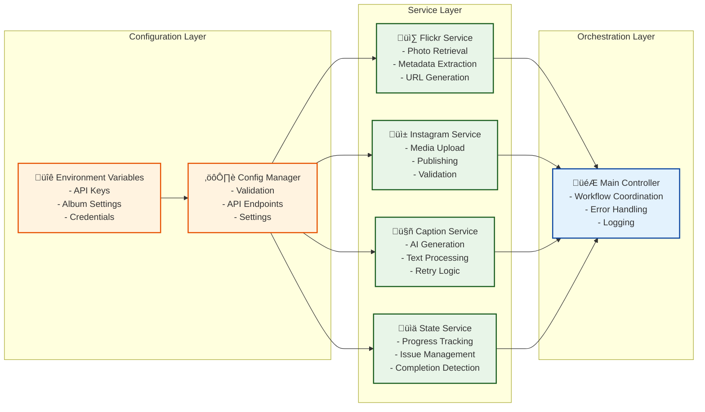
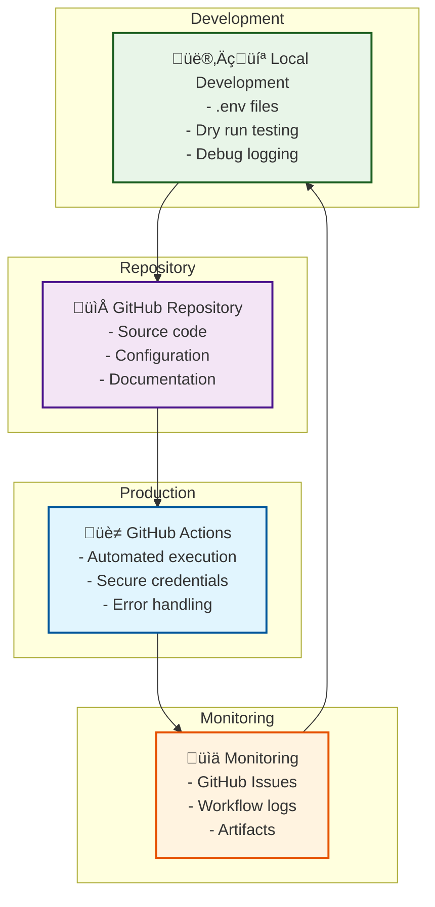

# Flickr to Instagram Automation

[](https://github.com/yourusername/your-repo-name/actions)
[](https://www.python.org/downloads/)
[](https://opensource.org/licenses/MIT)

[](https://www.flickr.com/services/api/)
[](https://developers.facebook.com/docs/instagram-api/)
[](https://openai.com/)

[]()
[](https://github.com/features/actions)
[]()

Automated social media posting system that posts one photo per day from a specific **Flickr album** to **Instagram** with **AI-generated captions** using GitHub Actions and OpenAI GPT Vision.

**Instagram's API** requires source photos to be published online. I chose my Flickr gallery as the source: https://flickr.com/photos/schaerer/albums/.

The *ID '72177720326826937'* of a **Flickr album** (found in the URL; for example, https://flickr.com/photos/schaerer/albums/72177720326826937) serves as the **source configuration key**.

### The Why - The motivation behind this automation
I take lots of photos that I edit in Adobe Lightroom and publish on my travel blogs, https://travelmemo.com in English and https://reisememo.ch in German.

However, I don't take the time to post them on Instagram. This automation helps me repurpose my photos.

## Features

- 📅 **Daily Posting**: Posts one photo per day until the album is complete
- 🎯 **Single Album Focus**: Processes one specific Flickr album
- 🤖 **AI-Generated Captions**: Uses OpenAI GPT-4 Vision for engaging Instagram captions
- 📊 **Scalable State Management**: Repository Variables system handles unlimited photos without repository pollution  
- 🔧 **Manual Control**: Run automation manually with different options
- 🛡️ **Smart Stopping**: Automatically stops when all photos are posted
- 📈 **Enhanced Context**: Incorporates EXIF data, location info, and blog URLs for richer AI captions
- 🔄 **Retry Logic**: Automatically retries failed posts and validates image URLs

## Quick Start

### 1. Repository Setup

1. Fork or clone this repository
2. In the file caption_generator.py, adapt the branding to reflect your own brand instead of my Travelmemo brand
3. No other code changes are needed - all configuration is done via environment variables
4. Optional: To change the publishing schedule, edit the workflow file social-media-automation.yml

### 2. Configure Secrets and Variables

Add the following **secrets** to your GitHub repository (`Settings > Secrets and variables > Actions > Environment secrets` in the `production-social-media` environment):

```
FLICKR_API_KEY=your_flickr_api_key
FLICKR_USER_ID=your_flickr_user_id
INSTAGRAM_ACCESS_TOKEN=your_instagram_access_token
INSTAGRAM_ACCOUNT_ID=your_instagram_business_account_id
OPENAI_API_KEY=your_openai_api_key
PERSONAL_ACCESS_TOKEN=your_github_personal_access_token_with_repo_scope
```

Add the following **variables** to your GitHub repository (`Settings > Secrets and variables > Actions > Repository variables`):

```
FLICKR_USERNAME=your_flickr_username
FLICKR_ALBUM_ID=your_flickr_album_id
GRAPH_API_VERSION=v18.0 (current Facebook/Instagram API version)
OPENAI_MODEL=gpt-4o-mini (current OpenAI vision model number. The mini version will do just fine at a lower cost)
```

### 3. First Run

1. Go to `Actions` tab in your repository
2. Click on "Flickr to Instagram Automation"
3. Click "Run workflow"
4. Check "Run without posting (dry run)" for testing
5. Click "Run workflow"

## How It Works

The automation follows this simple process:

1. **Daily Schedule**: Runs every day at 9 AM UTC
2. **Check Album**: Fetches all photos from your specified Flickr album
3. **Find Next Photo**: Identifies the next unposted photo
4. **Generate Caption**: Uses GPT-4 Vision to create an engaging caption
5. **Post to Instagram**: Publishes the photo with the generated caption
6. **Track Progress**: Records the post in GitHub Issues
7. **Auto-Complete**: Stops automatically when all photos are posted

## Album Configuration

### Setting Your Album

The system is now fully configurable via GitHub repository variables. No code changes are needed.

Set your Flickr album by updating the repository variables:
- `FLICKR_ALBUM_ID`: Your specific album ID
- `FLICKR_USERNAME`: Your Flickr username

To change albums, simply update the `FLICKR_ALBUM_ID` variable in your GitHub repository settings.

### Finding Your Album ID

Your Flickr album URL looks like:
```
https://flickr.com/photos/[your_username]/albums/72177720326826937
```

The album ID is the number at the end: `72177720326826937`

## Architecture Overview

The automation system follows a modular architecture with clear separation of concerns, robust error handling, and comprehensive state management.

```mermaid
graph TB
    %% External Services
    subgraph "External APIs"
        FA[📷 Flickr API<br/>Photo Retrieval]
        IA[📱 Instagram Graph API<br/>Photo Posting]
        OA[🤖 OpenAI GPT-4 Vision<br/>Caption Generation]
    end
    
    %% GitHub Infrastructure
    subgraph "GitHub Infrastructure"
        GR[📁 GitHub Repository<br/>Code & Configuration]
        GA[⚙️ GitHub Actions<br/>Workflow Engine]
        GI[📋 GitHub Issues<br/>State Management]
        GS[🔐 GitHub Secrets<br/>Credential Storage]
    end

    %% Core Application
    subgraph "Application Core"
        MC[🎮 main.py<br/>Orchestration]
        CF[⚙️ config.py<br/>Configuration]
        
        subgraph "API Integrations"
            FL[📷 flickr_api.py<br/>Photo Fetching]
            CG[🤖 caption_generator.py<br/>AI Caption Creation]
            IG[📱 instagram_api.py<br/>Social Media Posting]
        end
        
        SM[📊 state_manager.py<br/>Progress Tracking]
    end

    %% Triggers
    subgraph "Triggers"
        CR[⏰ Cron Schedule<br/>Daily at 9 AM UTC]
        MN[👤 Manual Trigger<br/>Workflow Dispatch]
    end

    %% Data Flow
    CR --> GA
    MN --> GA
    GA --> MC
    
    MC --> CF
    CF --> GS
    
    MC --> FL
    FL --> FA
    FA --> FL
    
    FL --> CG
    CG --> OA
    OA --> CG
    
    CG --> IG
    IG --> IA
    IA --> IG
    
    MC --> SM
    SM --> GI
    GI --> SM
    
    SM --> MC

    %% Styling
    classDef external fill:#e1f5fe,stroke:#01579b,stroke-width:2px
    classDef github fill:#f3e5f5,stroke:#4a148c,stroke-width:2px
    classDef core fill:#e8f5e8,stroke:#1b5e20,stroke-width:2px
    classDef trigger fill:#fff3e0,stroke:#e65100,stroke-width:2px
    
    class FA,IA,OA external
    class GR,GA,GI,GS github
    class MC,CF,FL,CG,IG,SM core
    class CR,MN trigger
```



### Data Flow Process


### Component Architecture



### Deployment Architecture


## Technology Stack

| Category | Component | Technology | Purpose |
|:---------|:----------|:-----------|:--------|
| **Infrastructure** | Orchestration | GitHub Actions | Workflow automation, scheduling |
| | Runtime | Python 3.11 | Core application logic |
| | State Storage | Repository Variables | Scalable progress tracking, unlimited photos |
| **Configuration** | Credentials | GitHub Secrets | Encrypted credential storage |
| | Settings | Environment Variables | Secure configuration management |
| **External APIs** | Photo Source | Flickr API | Photo metadata and URLs |
| | Social Media | Instagram Graph API | Photo posting and publishing |
| | AI Services | OpenAI GPT-4 Vision | AI-powered caption generation |
| **Reliability** | Error Handling | Exponential Backoff | Retry logic for API failures |
| | Monitoring | Python Logging | Comprehensive audit trails |
| | Validation | URL Checking | Image accessibility verification |

## API Setup

### Flickr API
1. Visit [Flickr App Garden](https://www.flickr.com/services/apps/create/)
2. Create a new app and get your API key
3. Find your User ID from your Flickr profile URL

### Instagram Graph API
1. Create a Facebook App at [developers.facebook.com](https://developers.facebook.com)
2. Add Instagram Graph API product
3. Get a long-lived access token
4. Connect your Instagram Business account

### OpenAI API
1. Sign up at [platform.openai.com](https://platform.openai.com)
2. Create an API key
3. Ensure you have credits for GPT-4 Vision

## Usage

### Scheduled Automation
- Runs automatically every day at 9 AM UTC
- Posts one photo per day from your album
- Automatically stops when all photos are posted
- No manual intervention required

### Manual Execution

#### GitHub Actions (Manual Trigger)
Use the manual workflow trigger with these options:
- **Dry Run**: Test without posting to Instagram  
- **Show Stats**: Display posting statistics and progress

#### Command Line (Local Testing)
```bash
# Install dependencies
pip install -r requirements.txt

# Post next photo (dry run)
python main.py --dry-run

# Post next photo (live)
python main.py

# Show statistics
python main.py --stats
```

## State Management

The system uses **Repository Variables** for scalable state tracking:

### State Variables Created
- `LAST_POSTED_POSITION_{album_id}` - Current progression through album
- `TOTAL_ALBUM_PHOTOS_{album_id}` - Total photos in album  
- `FAILED_POSITIONS_{album_id}` - Failed positions for retry
- `INSTAGRAM_POSTS_{album_id}` - Complete Instagram post audit trail

### Migration from GitHub Issues (August 2025)
- **Previous System**: Each photo created a GitHub Issue (127+ issues for small album)
- **New System**: Repository Variables provide O(1) performance for unlimited photos
- **Benefits**: Zero repository pollution, constant performance, complete audit trail
- **Backward Compatibility**: Legacy issue-based posts still supported

### Optional Audit Issues
Set `CREATE_AUDIT_ISSUES=true` in repository variables to create GitHub Issues for audit trail (disabled by default for scalability)

## Monitoring Progress

### View Statistics
Run the workflow with "Show statistics only" checked, or use:
```bash
python main.py --stats
```

This shows:
- Total photos in album
- Photos posted so far
- Photos remaining
- Completion percentage
- Success rate

### Check Individual Posts
View repository variables or optional GitHub Issues (if enabled) to see:
- Each photo that was posted (stored in `INSTAGRAM_POSTS_{album_id}` variable)
- Instagram post IDs and timestamps
- Current position and failed positions
- Complete audit trail without repository pollution

## Album Completion

When all photos in your album have been posted:

1. 🎉 The automation displays "Album complete!"
2. ⏸️ Scheduled runs automatically skip execution
3. 📊 Statistics show 100% completion
4. 🔄 To start a new album, update the `FLICKR_ALBUM_ID` variable in GitHub repository settings

## Project Structure

```
├── main.py                 # Main automation script
├── config.py              # Configuration management (environment variables)
├── flickr_api.py          # Flickr API integration
├── caption_generator.py   # OpenAI caption generation with enhanced context
├── instagram_api.py       # Instagram posting with retry logic
├── state_manager.py       # Repository Variables state management
├── requirements.txt       # Python dependencies
└── .github/
    └── workflows/
        └── flickr-to-instagram-automation.yml  # GitHub Actions workflow
```

## Common Issues & Troubleshooting

### Repository Variables Issues

**"403 Forbidden" when accessing repository variables**
```
Failed to set variable: Resource not accessible by integration: 403
```
- **Cause**: Using `GITHUB_TOKEN` instead of Personal Access Token  
- **Solution**: Create PAT with `repo` scope and add as `PERSONAL_ACCESS_TOKEN` in environment secrets

**Posted first photo instead of continuing from last position**
```
Posted position 1 instead of position 21
```
- **Cause**: Environment isolation - variables not accessible from workflow context
- **Solution**: Ensure PAT is added to correct environment (`production-social-media`) secrets

**Variables not being read correctly**
```
Variable LAST_POSTED_POSITION_72177720326837749 not found, using default: 0
```
- **Cause**: Workflow running outside environment context or insufficient permissions
- **Solution**: Verify environment configuration and PAT permissions

### Legacy Issues

**Album Complete Message**
```
🎉 Album complete! All photos have been posted to Instagram.
```
- This means all photos from your album have been successfully posted
- To start posting from a new album, update the `FLICKR_ALBUM_ID` variable in GitHub repository settings

**Missing Environment Variables**
```
Error: Missing required environment variables
```
- Ensure all secrets are configured in GitHub repository settings
- Check that secret names match exactly (case-sensitive)

**Instagram API Errors**
```
Error: Failed to create media container
```
- Check Instagram access token validity (tokens can expire)
- Verify business account connection
- Review Instagram API rate limits (200 requests/hour)

**OpenAI API Errors**
```
Error: Rate limit exceeded
```
- Check OpenAI account credits and usage limits
- Verify GPT-4 Vision model access
- Consider using GPT-4o-mini for lower costs

**Flickr API Errors**
```
Error: Failed to retrieve photos
```
- Verify Flickr API key and user ID
- Check album visibility settings (must be public or accessible)
- Ensure album ID is correct in your GitHub repository variables

**No Photos Found**
```
Warning: No photos found in the album
```
- Check that the album ID in your GitHub repository variables is correct
- Verify the album exists and contains photos
- Ensure album is public or accessible with your API key

### Debug Mode
Enable debug logging for troubleshooting:

```bash
python main.py --log-level DEBUG --dry-run
```

### Check Album Access
Test your Flickr album access:

```bash
# Check if your album is accessible
curl "https://www.flickr.com/services/rest/?method=flickr.photosets.getPhotos&api_key=YOUR_API_KEY&photoset_id=YOUR_ALBUM_ID&format=json&nojsoncallback=1"
```

## Security

- All API credentials stored as GitHub Secrets
- Environment-specific deployment protection
- Input validation for all external data
- Scalable state management via Repository Variables
- No credentials stored in code

## Support

For issues and questions:

1. **Check Configuration**: Verify your GitHub repository variables and secrets
2. **Test with Dry Run**: Use `--dry-run` flag to test without posting
3. **Review Logs**: Check GitHub Actions logs and artifacts
4. **Statistics**: Use `--stats` to check progress and identify issues
5. **GitHub Issues**: Don't create an issue because I don't have the resources to follow up

Use this repo for free. It comes as is, i.e. without any warranty whatsoever. 
I don't offer support due to limited time.

## Example Workflow

Here's what a typical automation cycle looks like:

1. **Day 1**: Posts photo 1/13 from your album
2. **Day 2**: Posts photo 2/13 from your album  
3. **Day 3**: Posts photo 3/13 from your album
4. ...
5. **Day 13**: Posts photo 13/13 from your album
6. **Day 14**: Shows "Album complete!" and stops

The automation intelligently tracks which photos have been posted and always selects the next unposted photo in the album order.

## Contributing

I'm working on this repo in a very limited capacity. Therefore, I can't review PRs or develop the functionality any further.

## License

This project is licensed under the MIT License.
